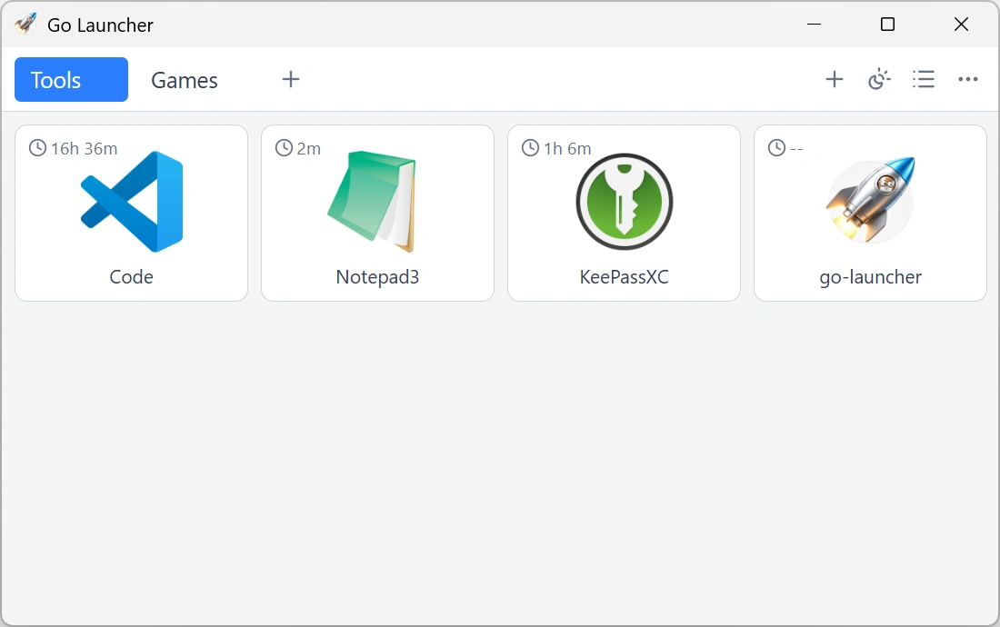

# go-launcher

<p align="center">
  
  <br>
  
</p>


A minimal [Wails](https://wails.io/) desktop launcher app for Go. It opens a
window listing files/programs (with icons and accumulated runtime), letting you
run/stop them, drag & drop to add more, and manage entries via a per-item menu.

## Requirements

- Go 1.26 or later
- [bun](https://bun.sh) (package manager for the frontend)
- Wails CLI: `go install github.com/wailsapp/wails/v2/cmd/wails@latest`
- **Windows**: WebView2 runtime (preinstalled on Windows 10/11). No C compiler needed.

## Run (development)

```sh
wails dev
```

This starts the Vite dev server and rebuilds/relaunches the app on changes.

## Build

```sh
wails build
# or, on Windows:
.\build.ps1
```

The binary is produced at `build/bin/go-launcher.exe` and copied to `go-launcher.exe`.

## Structure

- `main.go` — Wails app bootstrap (`wails.Run`, embeds `frontend/dist`)
- `app.go` — the `App` struct with the methods bound to the frontend (add/remove/rename, run/stop, icons, etc.) plus the launcher data persistence
- `frontend/` — **Vite + Vue 3 + TypeScript + Tailwind CSS + Headless UI** frontend, managed with bun
  - `src/api.ts` — typed wrappers around the generated `wailsjs` Go bindings
  - `src/composables/useLauncher.ts` — reactive item list, Wails events & file drop
  - `src/components/` — `LauncherRow` (Headless UI `Menu`), `ModalDialog` (Headless UI `Dialog`)
  - `eslint.config.mjs` — [@antfu/eslint-config](https://github.com/antfu/eslint-config)
  - scripts: `bun run dev` / `build` / `typecheck` / `lint` / `lint:fix`
- `utils.go`, `launch_*.go`, `icon_*.go` — platform helpers (path normalization, process launching, icon extraction)

## References

- [Icon generation](./docs/ICON.md)
- [Wails documentation](https://wails.io/docs/introduction)
- [Wails on GitHub](https://github.com/wailsapp/wails)
